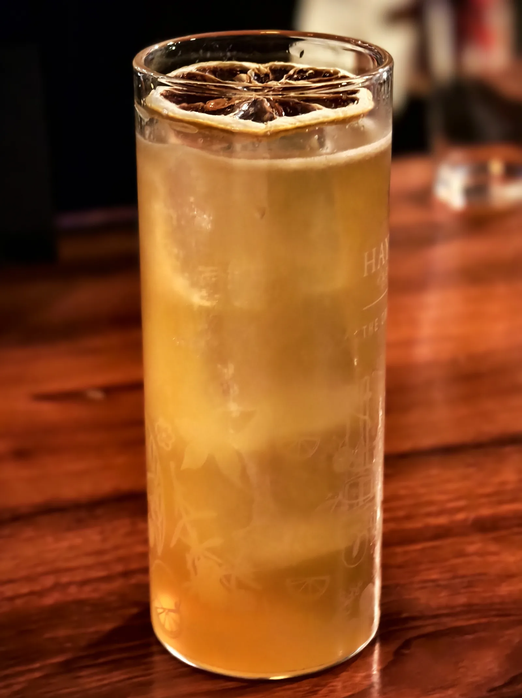

## 本周工作

- C++答辩

- 优化字幕软件TMspeech，加了云翻译的选项

- 前端诊断Agent，但没完成

- 高数核心题复习

## 下周工作

- 高数，物理复习
---

​	这周C++的课设答辩差点翻车：vibe coding的项目被老师拷问细节，一个也答不出来，最后还是过了。我实在不喜欢学C++，所以做课设的时候从没认真看过

​	做项目前期规划时，发现GPT5.5在这方面还有短板，尤其是发散的思维深度不够。所以我订了一个cc的pro，用opus试着做规划，效果很好，它会为我列好方案并且用说明来引导我如何确定方向和搭建框架。所以这周我还花时间用opus给老工具优化了一遍功能

​	这周五周六一直在外面玩，周五萨莉亚，周六火锅自助+酒吧，期末考试前的风光大葬

---

## C++

​	不知道为什么我们学院的教学方案全是C++，很烦，可能因为学院的老师全都是做opencv方向的，以至于第一节课就开始给我们讲OpenCV，但我觉得这个方向压根没啥好讲的，无论工业界还是学术界全都是路边一条

---

## 酒吧

​	其实这是我第一次去酒吧。本来只打算吃火锅，我随口开玩笑说要不要去喝酒，结果有同学应了，而且还很认真的问我怎么规划

​	我想起来以前有一个朋友很喜欢调酒文化，他对调酒文化的热爱来源于VA-11 Hall-A 这个游戏，而我对酒吧的好奇则来源于他，如今那个朋友和我决裂很久了，但我还是很想了解他

​	所以我带同学去了一个平价的清吧，因为清吧和游戏里的环境很像，我想感受他眼里的酒吧氛围

​	酒的价格对我来说很贵，但是也很好喝，我点了杯长岛冰茶和一个苹果味的特调，加起来120多

*长岛冰茶，30多度，味道很烈*

​	调酒师们很有耐心，会认真解答我那些看起来有点"笨"的问题，偶尔还会送上一小杯酒或一点零食；客人们也不像我想象中那样安静端庄，而是自顾自地聊着天，很松弛

​	这里的一切于我都很新奇。它回应着我初高中时路过霓虹酒吧时的张望，也悄悄祛魅了我对夜晚世界的全部想象

---

## 朋友的关系

​	提到酒，我总会想起来我曾经的一个朋友，他其实不爱喝酒，只是喜欢调酒文化，喜欢那个游戏给他带来的美好邂逅，喜欢带他认识这个游戏的人

​	我也一样，我只是喜欢了解他，并不喜欢喝酒，也不喜欢去追逐夜生活，这种虚假的感觉曾经让我感到非常内疚和自责

​	有句话让我感触特别深："虚假其实没什么，关键是要承认自己也是虚假的。"这是有次在群里闲聊，看到群友提起类似的话题时，Joye给出的回答。就是这句话，让我对从前的许多事都释然了不少。整段感悟或许听起来有点幼稚，但这也正是Joye让我印象如此深刻的原因之一
